# Plan Mode

Plan mode is a sophisticated execution framework within gollem that enables autonomous multi-step task planning and execution. It transforms high-level user goals into structured, adaptive execution plans.

## Prerequisites

Before diving into Plan Mode, you should understand:
- **gollem**: A Go framework for building LLM-powered agents with tool-calling capabilities
- **Agent**: The core component that manages conversations with LLMs and executes tools
- **Tools**: Functions that agents can call to perform specific tasks (e.g., file operations, API calls)

## Why Plan Mode?

### The Problem with Single-Turn LLM Interactions

Traditional LLM agents operate in a single-turn fashion:
1. User provides a complex request
2. LLM attempts to fulfill it in one response
3. Often results in incomplete or shallow results

This approach fails for tasks that require:
- Multiple steps with intermediate results
- Adaptation based on discoveries
- Long-running operations with progress tracking
- Coordination of multiple tools

### Why Plan-Execute Architecture?

Plan Mode separates **thinking** from **doing**:

```
Traditional: Think → Do → Think → Do (all mixed together)
Plan Mode:   Think (plan) → Do → Reflect → Do → Reflect → Summarize
```

This separation provides:

1. **Clear Intent**: The plan phase creates a roadmap before any execution begins
2. **Better Context**: Each execution step knows its purpose within the larger goal
3. **Reduced Errors**: LLMs don't mix planning logic with execution logic
4. **Adaptability**: Plans can evolve based on real execution results

### Why the Reflect-Execute Loop?

The reflection phase after each step is crucial because:

1. **Real-World Uncertainty**: Initial plans are based on assumptions that may prove incorrect
   ```
   Plan: "Analyze log files for errors"
   Reality: Log files are in unexpected format or location
   Reflection: Adapt plan to handle new format
   ```

2. **Progressive Discovery**: Each step reveals new information
   ```
   Step 1: Found 10 security vulnerabilities
   Reflection: Add new step to prioritize by severity
   Step 2: Prioritize vulnerabilities
   Reflection: Critical issues found, add immediate remediation step
   ```

3. **Efficient Execution**: Skip redundant work
   ```
   Plan: Step 3 - Generate vulnerability report
   Reflection: Step 2 already generated comprehensive report, skip step 3
   ```

### How Plans Terminate

Plans complete through one of several mechanisms:

1. **Natural Completion**: All tasks executed successfully
   ```
   ✅ Step 1: Analyze logs
   ✅ Step 2: Generate report
   ✅ Step 3: Create recommendations
   → Plan completes naturally
   ```

2. **Goal Achievement**: Reflection determines goal is met early
   ```
   Original plan: 5 steps
   After step 3: Reflection determines goal fully achieved
   → Remaining steps skipped, plan completes
   ```

3. **Reflection-Driven Completion**: Reflector explicitly signals completion
   ```json
   {
     "reflection_type": "complete",
     "response": "All security vulnerabilities identified and documented"
   }
   ```

4. **Error Termination**: Unrecoverable error occurs
   ```
   Step fails with critical error
   → Plan terminates with error status
   ```

5. **Tool-Initiated Exit**: A tool signals conversation should end
   ```go
   return nil, gollem.ErrExitConversation
   ```

Plan Mode addresses these challenges by:

1. **Decomposing Complex Tasks**: "Analyze our codebase and create documentation" becomes multiple concrete steps
2. **Maintaining Focus**: Each phase has a specific purpose, preventing the LLM from mixing planning with execution
3. **Enabling Adaptation**: Plans can evolve based on discoveries during execution
4. **Providing Visibility**: Hooks and progress tracking for monitoring long-running tasks

## Real-World Use Cases

Plan Mode excels at tasks like:

- **Security Audits**: Analyze logs → Identify vulnerabilities → Generate report → Create remediation plan
- **Code Analysis**: Understand architecture → Find issues → Suggest improvements → Implement fixes
- **Research Tasks**: Gather information → Analyze findings → Synthesize insights → Create summary
- **Data Processing**: Extract data → Transform → Validate → Generate visualizations
- **Documentation**: Analyze codebase → Generate docs → Create examples → Update README

## Table of Contents

1. [Architecture & Concepts](#architecture--concepts)
2. [Getting Started](#getting-started)
3. [Configuration & Customization](#configuration--customization)
4. [Advanced Features](#advanced-features)
5. [Best Practices](#best-practices)
6. [API Reference](#api-reference)

## Architecture & Concepts

### How Plan Mode Differs from Regular Agent Usage

```go
// Regular Agent: Direct execution, no planning
response, _ := agent.Chat(ctx, "Analyze security logs")
// Result: Single response, limited to one-shot analysis

// Plan Mode: Structured, multi-step execution
plan, _ := agent.Plan(ctx, "Analyze security logs and create remediation plan")
result, _ := plan.Execute(ctx)
// Result: Step-by-step analysis, findings, and actionable remediation plan
```

### Execution Phases

Plan mode operates through five distinct phases, each with a specific purpose:


### Hook Execution Timeline

The following diagram shows when each hook is triggered during plan execution:

```mermaid
sequenceDiagram
    participant User
    participant Plan
    participant Hook
    participant Tool
    participant LLM

    User->>Plan: agent.Plan(ctx, goal)
    Plan->>LLM: Clarify goal
    LLM-->>Plan: Clarified goal
    Plan->>LLM: Create plan
    LLM-->>Plan: Todo list
    Plan->>Hook: 🎯 WithPlanCreatedHook
    
    User->>Plan: plan.Execute(ctx)
    
    loop For each ToDo
        Plan->>Hook: ▶️ WithPlanToDoStartHook
        Plan->>LLM: Execute step
        LLM->>Tool: Call tool
        Tool-->>LLM: Tool result
        LLM-->>Plan: Step result

        alt Task Completed
            Plan->>Hook: ✅ WithPlanToDoCompletedHook
        else Task Failed
            Plan->>Hook: ❌ WithPlanToDoCompletedHook (with error)
        end

        Plan->>LLM: Reflect on progress
        LLM-->>Plan: Reflection result

        alt Skip Decision
            Plan->>Hook: ⏭️ WithSkipConfirmationHook
            Hook-->>Plan: Skip approved/denied
        end

        alt Plan Modified
            Plan->>Hook: 📝 WithPlanToDoUpdatedHook
        end
    end
    
    Plan->>LLM: Summarize results
    LLM-->>Plan: Final summary
    Plan->>Hook: ✨ WithPlanCompletedHook
    Plan-->>User: Final result
```



### Hook Categories by Phase


#### 1. Clarifying Phase (`PhaseClarifying`)
- **Purpose**: Transform vague requests into clear goals
- **Session Type**: New specialized session
- **Example**: "Help with security" → "Analyze application logs for security vulnerabilities in the last 24 hours"

#### 2. Planning Phase (`PhasePlanning`)
- **Purpose**: Create concrete, executable steps
- **Session Type**: New specialized session
- **Example Output**:
  ```
  1. Scan application logs for authentication failures
  2. Identify unusual access patterns
  3. Check for SQL injection attempts
  4. Generate vulnerability report
  ```

#### 3. Executing Phase
- **Purpose**: Run each task with available tools
- **Session Type**: Main agent session (reuses existing context)
- **Example**: Executes log analysis tools, pattern matching, report generation

#### 4. Reflecting Phase (`PhaseReflecting`)
- **Purpose**: Evaluate progress and adapt plan
- **Session Type**: New specialized session
- **Decisions Made**:
  - Should we continue to next step?
  - Do we need additional steps?
  - Can we skip redundant tasks?
  - Is the goal achieved?

#### 5. Summarizing Phase (`PhaseSummarizing`)
- **Purpose**: Compile coherent final result
- **Session Type**: New specialized session
- **Output**: Executive summary, key findings, recommendations

### Core Data Structures

#### Plan Structure
```go
type Plan struct {
    ID     string      // Unique identifier
    Input  string      // Original user goal
    State  string      // created, running, completed, failed
    ToDos  []PlanToDo  // Task list
    Session Session    // Independent conversation history
}
```

#### PlanToDo Structure
```go
type PlanToDo struct {
    ID          string           // Unique identifier
    Description string           // "Analyze authentication logs"
    Intent      string           // "Identify security vulnerabilities"
    Status      string           // Pending, Executing, Completed, Failed, Skipped
    Completed   bool            // Completion flag
    Error       error           // Any errors encountered
    Result      *PlanToDoResult // Execution results
}
```

### Session Independence

Plan mode maintains complete isolation from the main agent:
- Each plan has its own conversation history
- Plan execution doesn't affect agent state
- Enables concurrent plan execution
- History persists through serialization

## Getting Started

### Basic Example with Real Tools

```go
package main

import (
    "context"
    "fmt"
    "os"
    "strings"
    "github.com/m-mizutani/gollem"
    "github.com/m-mizutani/gollem/llm/openai"
)

// FileAnalyzer reads and analyzes files
type FileAnalyzer struct{}

func (f *FileAnalyzer) Spec() gollem.ToolSpec {
    return gollem.ToolSpec{
        Name:        "analyze_file",
        Description: "Analyze a file for specific patterns or content",
        Parameters: map[string]*gollem.Parameter{
            "path": {
                Type:        gollem.TypeString,
                Description: "File path to analyze",
            },
            "pattern": {
                Type:        gollem.TypeString,
                Description: "What to look for",
            },
        },
        Required: []string{"path", "pattern"},
    }
}

func (f *FileAnalyzer) Run(ctx context.Context, args map[string]any) (map[string]any, error) {
    path := args["path"].(string)
    pattern := args["pattern"].(string)
    
    content, err := os.ReadFile(path)
    if err != nil {
        return nil, err
    }
    
    // Simplified analysis
    found := strings.Contains(string(content), pattern)
    count := strings.Count(string(content), pattern)
    
    return map[string]any{
        "found":       found,
        "occurrences": count,
        "file_size":   len(content),
    }, nil
}

// ReportGenerator creates formatted reports
type ReportGenerator struct{}

func (r *ReportGenerator) Spec() gollem.ToolSpec {
    return gollem.ToolSpec{
        Name:        "generate_report",
        Description: "Generate a formatted report from findings",
        Parameters: map[string]*gollem.Parameter{
            "findings": {
                Type:        gollem.TypeObject,
                Description: "Analysis findings to include",
            },
            "format": {
                Type:        gollem.TypeString,
                Description: "Report format (markdown, json, text)",
                Default:     "markdown",
            },
        },
        Required: []string{"findings"},
    }
}

func (r *ReportGenerator) Run(ctx context.Context, args map[string]any) (map[string]any, error) {
    findings := args["findings"]
    format := args["format"].(string)
    
    // Generate report based on format
    var report string
    switch format {
    case "markdown":
        report = fmt.Sprintf("# Security Analysis Report\n\n%v", findings)
    default:
        report = fmt.Sprintf("%v", findings)
    }
    
    return map[string]any{
        "report": report,
        "format": format,
    }, nil
}

func main() {
    // Initialize
    client, _ := openai.New(context.Background(), os.Getenv("OPENAI_API_KEY"))
    agent := gollem.New(client,
        gollem.WithTools(&FileAnalyzer{}, &ReportGenerator{}),
    )

    // Create and execute plan
    plan, err := agent.Plan(context.Background(),
        "Analyze all log files in /var/log for security issues and create a report",
        gollem.WithPlanToDoStartHook(func(ctx context.Context, p *gollem.Plan, todo gollem.PlanToDo) error {
            fmt.Printf("▶️  Starting: %s\n", todo.Description)
            return nil
        }),
        gollem.WithPlanToDoCompletedHook(func(ctx context.Context, p *gollem.Plan, todo gollem.PlanToDo) error {
            fmt.Printf("✅ Completed: %s\n", todo.Description)
            return nil
        }),
    )
    
    if err != nil {
        panic(err)
    }

    result, err := plan.Execute(context.Background())
    if err != nil {
        panic(err)
    }

    fmt.Println("\nFinal Result:")
    fmt.Println(result)
}
```

### Plan Serialization for Stateless Apps

```go
// Web handler that creates a plan
func handleCreatePlan(w http.ResponseWriter, r *http.Request) {
    goal := r.FormValue("goal")
    
    plan, err := agent.Plan(r.Context(), goal)
    if err != nil {
        http.Error(w, err.Error(), 500)
        return
    }
    
    // Serialize for storage
    data, _ := plan.Serialize()
    
    // Store in database
    planID := savePlanToDatabase(data)
    
    // Return plan ID to client
    json.NewEncoder(w).Encode(map[string]string{
        "plan_id": planID,
        "status": "created",
    })
}

// Web handler that executes a plan
func handleExecutePlan(w http.ResponseWriter, r *http.Request) {
    planID := r.FormValue("plan_id")
    
    // Retrieve from database
    data := loadPlanFromDatabase(planID)
    
    // Restore plan with same agent configuration
    plan, err := agent.NewPlanFromData(r.Context(), data)
    if err != nil {
        http.Error(w, err.Error(), 500)
        return
    }
    
    // Execute
    result, err := plan.Execute(r.Context())
    if err != nil {
        http.Error(w, err.Error(), 500)
        return
    }
    
    json.NewEncoder(w).Encode(map[string]string{
        "result": result,
        "status": "completed",
    })
}
```

## Configuration & Customization

### System Prompts

Control behavior through two types of system prompts:

#### 1. Main Execution Prompt
Controls the agent's behavior during task execution:

```go
plan, err := agent.Plan(ctx, "Analyze security vulnerabilities",
    gollem.WithPlanSystemPrompt("You are a security expert. Focus on OWASP Top 10."),
)
```

#### 2. Phase-Specific Prompts
Fine-tune each phase's behavior:

```go
plan, err := agent.Plan(ctx, "Create comprehensive documentation",
    gollem.WithPlanPhaseSystemPrompt(func(ctx context.Context, phase gollem.PlanPhaseType, plan *gollem.Plan) string {
        switch phase {
        case gollem.PhaseClarifying:
            return "Identify all documentation needs including API docs, guides, and examples."
            
        case gollem.PhasePlanning:
            return "Create a documentation plan that covers: architecture, API reference, tutorials, and troubleshooting."
            
        case gollem.PhaseReflecting:
            if plan != nil {
                todos := plan.GetToDos()
                completed := 0
                for _, todo := range todos {
                    if todo.Completed {
                        completed++
                    }
                }
                
                if completed == 0 {
                    return "Focus on whether the documentation structure is logical."
                } else if completed < len(todos)/2 {
                    return "Assess if the documentation is comprehensive enough."
                } else {
                    return "Ensure all critical topics are covered and examples work."
                }
            }
            return "Evaluate documentation completeness."
            
        case gollem.PhaseSummarizing:
            return "Create a summary highlighting what was documented and any gaps found."
            
        default:
            return ""
        }
    }),
)
```

### Progress Monitoring

#### Real-Time Progress Display
```go
type ProgressTracker struct {
    startTime time.Time
    mu        sync.Mutex
}

func (pt *ProgressTracker) CreateHooks() []gollem.PlanOption {
    return []gollem.PlanOption{
        gollem.WithPlanCreatedHook(func(ctx context.Context, plan *gollem.Plan) error {
            pt.startTime = time.Now()
            todos := plan.GetToDos()
            fmt.Printf("\n📋 Plan created with %d steps\n", len(todos))
            for i, todo := range todos {
                fmt.Printf("   %d. %s\n", i+1, todo.Description)
            }
            fmt.Println()
            return nil
        }),
        
        gollem.WithPlanToDoStartHook(func(ctx context.Context, plan *gollem.Plan, todo gollem.PlanToDo) error {
            pt.mu.Lock()
            defer pt.mu.Unlock()
            
            elapsed := time.Since(pt.startTime).Round(time.Second)
            fmt.Printf("[%s] ▶️  Starting: %s\n", elapsed, todo.Description)
            return nil
        }),
        
        gollem.WithPlanToDoCompletedHook(func(ctx context.Context, plan *gollem.Plan, todo gollem.PlanToDo) error {
            pt.mu.Lock()
            defer pt.mu.Unlock()
            
            icon := "✅"
            if todo.Status == "Failed" {
                icon = "❌"
            } else if todo.Status == "Skipped" {
                icon = "⏭️"
            }
            
            elapsed := time.Since(pt.startTime).Round(time.Second)
            todos := plan.GetToDos()
            completed := 0
            for _, t := range todos {
                if t.Completed {
                    completed++
                }
            }
            
            progress := float64(completed) / float64(len(todos)) * 100
            fmt.Printf("[%s] %s %s (Progress: %.0f%%)\n", 
                elapsed, icon, todo.Description, progress)
            
            return nil
        }),
        
        gollem.WithPlanCompletedHook(func(ctx context.Context, plan *gollem.Plan, result string) error {
            duration := time.Since(pt.startTime).Round(time.Second)
            fmt.Printf("\n✨ Plan completed in %s\n", duration)
            return nil
        }),
    }
}

// Usage
tracker := &ProgressTracker{}
plan, err := agent.Plan(ctx, "Complex task", tracker.CreateHooks()...)
```

## Advanced Features

### Adaptive Skip Functionality

Plan mode intelligently skips redundant tasks:

```go
// Example: Security audit that adapts based on findings
plan, err := agent.Plan(ctx, "Perform security audit",
    gollem.WithPlanExecutionMode(gollem.PlanExecutionModeBalanced),
    gollem.WithSkipConfidenceThreshold(0.8),
    
    gollem.WithSkipConfirmationHook(func(ctx context.Context, plan *gollem.Plan, decision gollem.SkipDecision) bool {
        // Log skip decisions
        log.Printf("Skip Decision: %s (confidence: %.2f)\n", 
            decision.SkipReason, decision.Confidence)
        
        // Auto-approve if very confident
        if decision.Confidence >= 0.95 {
            return true
        }
        
        // Require confirmation for medium confidence
        if decision.Confidence >= 0.7 {
            fmt.Printf("\nSkip '%s'?\nReason: %s\nConfidence: %.0f%%\n",
                decision.TodoID, decision.SkipReason, decision.Confidence*100)
            fmt.Print("Skip? (y/n): ")
            
            var response string
            fmt.Scanln(&response)
            return strings.ToLower(response) == "y"
        }
        
        return false
    }),
)
```

### Error Handling in Practice

```go
func executePlanWithRetry(agent *gollem.Agent, goal string, maxRetries int) (*gollem.Plan, string, error) {
    var lastErr error
    
    for attempt := 1; attempt <= maxRetries; attempt++ {
        plan, err := agent.Plan(context.Background(), goal,
            gollem.WithPlanToDoCompletedHook(func(ctx context.Context, p *gollem.Plan, todo gollem.PlanToDo) error {
                if todo.Error != nil {
                    log.Printf("Task failed: %s - %v", todo.Description, todo.Error)
                }
                return nil
            }),
        )
        
        if err != nil {
            lastErr = err
            log.Printf("Failed to create plan (attempt %d/%d): %v", attempt, maxRetries, err)
            continue
        }
        
        result, err := plan.Execute(context.Background())
        if err != nil {
            switch err {
            case gollem.ErrPlanAlreadyExecuted:
                // Plan was already completed
                return plan, result, nil
                
            case gollem.ErrPlanNotInitialized:
                // Critical error - plan missing components
                return nil, "", fmt.Errorf("plan initialization failed: %w", err)
                
            default:
                lastErr = err
                log.Printf("Execution failed (attempt %d/%d): %v", attempt, maxRetries, err)
                
                // Check if any tasks succeeded
                todos := plan.GetToDos()
                successCount := 0
                for _, todo := range todos {
                    if todo.Status == "Completed" {
                        successCount++
                    }
                }
                
                if successCount > 0 {
                    log.Printf("Partial success: %d/%d tasks completed", successCount, len(todos))
                    // Could implement partial recovery here
                }
                continue
            }
        }
        
        return plan, result, nil
    }
    
    return nil, "", fmt.Errorf("all attempts failed: %w", lastErr)
}
```

### Execution Iteration Limits

Plan mode includes automatic iteration limiting to prevent infinite loops during task execution:

```go
// Default: 16 iterations per todo
plan, err := agent.Plan(ctx, "Complex analysis task")

// Custom iteration limit
plan, err := agent.Plan(ctx, "Resource-intensive task",
    gollem.WithPlanMaxIterations(10), // Lower limit for faster termination
)
```

#### How It Works

1. **Per-Todo Tracking**: Each todo tracks its own iteration count
2. **Automatic Termination**: When limit is reached, execution stops gracefully
3. **Prompt Awareness**: LLM is informed of current iteration and remaining attempts
4. **Reflection Handling**: Reflection phase decides how to handle iteration-limited tasks

#### Example with Iteration Information

```go
plan, err := agent.Plan(ctx, "Analyze complex dataset",
    gollem.WithPlanMaxIterations(5),
    gollem.WithPlanToDoCompletedHook(func(ctx context.Context, p *gollem.Plan, todo gollem.PlanToDo) error {
        if todo.Result != nil && strings.Contains(todo.Result.Output, "Iteration limit reached") {
            log.Printf("⚠️  Task %s hit iteration limit", todo.Description)
        }
        return nil
    }),
)
```

#### Benefits

- **Prevents Runaway Execution**: Protects against infinite loops
- **Resource Management**: Controls computational costs
- **Graceful Degradation**: Tasks complete with partial results rather than hanging
- **Transparency**: LLM knows iteration status and can plan accordingly

## Best Practices

### 1. Design Clear, Focused Tools

```go
// ❌ Bad: Vague, multi-purpose tool
type DataTool struct{}
func (t *DataTool) Spec() gollem.ToolSpec {
    return gollem.ToolSpec{
        Name: "process_data",
        Description: "Process data",
    }
}

// ✅ Good: Specific, single-purpose tool
type CSVReader struct{}
func (t *CSVReader) Spec() gollem.ToolSpec {
    return gollem.ToolSpec{
        Name:        "read_csv",
        Description: "Read and parse CSV files with configurable options",
        Parameters: map[string]*gollem.Parameter{
            "file_path": {
                Type:        gollem.TypeString,
                Description: "Path to CSV file",
            },
            "has_header": {
                Type:        gollem.TypeBoolean,
                Description: "Whether first row contains headers",
                Default:     true,
            },
            "delimiter": {
                Type:        gollem.TypeString,
                Description: "Field delimiter character",
                Default:     ",",
            },
        },
        Required: []string{"file_path"},
    }
}
```

### 2. Handle Concurrent Plans Safely

```go
// Plan executor service
type PlanExecutor struct {
    agent *gollem.Agent
    wg    sync.WaitGroup
}

func (pe *PlanExecutor) ExecutePlan(ctx context.Context, goal string) {
    pe.wg.Add(1)
    go func() {
        defer pe.wg.Done()
        
        // Each goroutine gets its own plan instance
        plan, err := pe.agent.Plan(ctx, goal)
        if err != nil {
            log.Printf("Failed to create plan: %v", err)
            return
        }
        
        result, err := plan.Execute(ctx)
        if err != nil {
            log.Printf("Plan execution failed: %v", err)
            return
        }
        
        log.Printf("Plan completed: %s", result)
    }()
}

func (pe *PlanExecutor) Shutdown() {
    pe.wg.Wait()
}
```

### 3. Monitor Resource Usage

```go
// Resource-aware plan execution
func executeWithResourceLimits(plan *gollem.Plan, maxDuration time.Duration, maxMemoryMB int) error {
    ctx, cancel := context.WithTimeout(context.Background(), maxDuration)
    defer cancel()
    
    // Monitor memory usage
    done := make(chan bool)
    go func() {
        ticker := time.NewTicker(5 * time.Second)
        defer ticker.Stop()
        
        for {
            select {
            case <-done:
                return
            case <-ticker.C:
                var m runtime.MemStats
                runtime.ReadMemStats(&m)
                usedMB := int(m.Alloc / 1024 / 1024)
                
                if usedMB > maxMemoryMB {
                    log.Printf("Memory limit exceeded: %dMB > %dMB", usedMB, maxMemoryMB)
                    cancel()
                    return
                }
            }
        }
    }()
    
    _, err := plan.Execute(ctx)
    close(done)
    
    return err
}
```

## API Reference

### Plan Creation Options

| Option | Description | Default |
|--------|-------------|---------|
| `WithPlanSystemPrompt(prompt)` | Set main execution prompt | None |
| `WithPlanPhaseSystemPrompt(provider)` | Set phase-specific prompts | None |
| `WithPlanHistory(history)` | Provide initial conversation history | Empty |
| `WithPlanExecutionMode(mode)` | Control task skipping behavior | Balanced |
| `WithSkipConfidenceThreshold(threshold)` | Set skip confidence threshold | 0.8 |
| `WithPlanAutoCompact(enabled)` | Enable history compaction | false |
| `WithPlanMaxHistorySize(size)` | Maximum history size before compaction | 100 |
| `WithPlanMaxIterations(max)` | Maximum iterations per todo execution | 16 |

### Hook Types

| Hook | Trigger | Use Case |
|------|---------|----------|
| `WithPlanCreatedHook` | Plan creation complete | Initialize monitoring |
| `WithPlanCompletedHook` | Plan execution complete | Cleanup, notifications |
| `WithPlanToDoStartHook` | Task execution starts | Progress updates |
| `WithPlanToDoCompletedHook` | Task execution ends | Error handling |
| `WithPlanToDoUpdatedHook` | Plan modifications | Track changes |
| `WithSkipConfirmationHook` | Skip decision made | User confirmation |

**Note**: For monitoring LLM responses and tool execution, use agent-level middleware:
- `WithContentBlockMiddleware` for LLM response monitoring
- `WithToolMiddleware` for tool execution monitoring

### Plan Methods

| Method | Description | Returns |
|--------|-------------|---------|
| `Execute(ctx)` | Execute the plan | Result string, error |
| `GetToDos()` | Get all tasks (read-only copies) | []PlanToDo |
| `Session()` | Access plan's session | Session interface |
| `Serialize()` | Convert to JSON for storage | []byte, error |

### Error Types

| Error | Description | Recovery |
|-------|-------------|----------|
| `ErrPlanAlreadyExecuted` | Plan was already completed | Use result from previous execution |
| `ErrPlanNotInitialized` | Missing agent or session | Recreate plan with proper initialization |
| `ErrExitConversation` | Tool requested termination | Normal completion signal |

## Examples & Resources

### Complete Examples
- [Basic Plan Mode](../examples/plan_mode/) - Simple multi-step workflow
- [Plan with Compaction](../examples/plan_compaction/) - Long-running plans with history management
- [MCP Integration](../examples/mcp/) - Using external tool servers

### Common Patterns
- [Security Audit Workflow](#real-world-use-cases) - Log analysis and vulnerability detection
- [Documentation Generator](#phase-specific-prompts) - Automated documentation creation
- [Data Processing Pipeline](#advanced-features) - ETL with adaptive skipping

### Troubleshooting

**Q: Plan fails with "not initialized" error**
- Ensure you're using `agent.NewPlanFromData()` for deserialization
- Check that the agent has the same tools as when the plan was created

**Q: Tasks are being skipped unexpectedly**
- Review skip confidence threshold
- Implement custom skip confirmation hook
- Use `PlanExecutionModeComplete` to disable skipping

**Q: Memory usage grows with long plans**
- Use appropriate loop limits with `WithLoopLimit()`
- Monitor history size with plan hooks